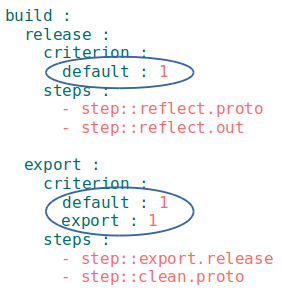

# Criterions

Element of comparison for selection of the resources.

In `willfile` the map of criterions is represented by an associative array. Each resource can have any number of criterions. Criterions are used by selection by one resource another one through [selector with glob](Selector.md#Selector-with-glob). Criterions are not used in selector without glob as this selector has no ambiguity.

### Example

```yml
path :

  out.debug :
    path : out/debug
    criterion :
      debug : 1
  out.release :
    path : out/release
    criterion :
      debug : 0

step :

  delete.files :
    inherit : predefined.delete
    filePath : path::out.*
  criterion :
    debug : 1
```
For example, in the `step::delete.files` step, the` path::out.debug` path is used, which is selected through the selector with the glob `path::out.*`. The utility knows that one of the two possible paths `path::out.debug` or` path::out.release` is needed. The `path::out.debug` is selected because the step `step::delete.files` and path `path::out.debug` has the criterion `debug:1`.

### Instantiation of critetions

In `willfile` for a single criterion it is possible to establish a set of values. Herewith not one [resource](Structure.md#Resources) will be created, but, as many different values combinations of the criterion of this resource as possible.

```yaml
step :
  delete.files :
    inherit : predefined.delete
    filePath : path::out.*
  criterion :
    raw : 1           # single meaning - ordinary form of writing
    debug : [ 0,1 ]   # plural meaning - record in array form, used by instantiation of criterions
```

The step `step::delete.files`, which has two criterions `raw` and `debug`, is defined. The `debug` criterion has a plural value. Therefore during instantiation of criterions, the two steps `delete.files.` and `delete.files.debug` are created.

[Tutorial](../tutorial/WillFileMinimization.md) about instantiation of criterions.

### Possible values.

Criterions can have Boolean or string values.

```yaml
condition : false       # Boolean value
compile : 1             # Boolean value
raw : one               # String value
name : name1            # String value
```

`false` and `0` -- considered to be an alias.
`true` and `1` -- considered to be an alias.

### Resource by default

The `default` criterion has a particular meaning. The resource with the `default:1` criterion is considered as the default resource. By means of `default: 1` criterion, you can specify the [build](ResourceBuild.md#Resource-build), which is built by default.


### Criterion of the build for the export

The special `export: 1` criterion differentiates the build which is intended for [export](ResourceBuild.md#Resource-export) of the module from other builds of this module.



This module has one regular build and one export. The `will .build` command will execute the build` build::release ` and` will .export` command will execute the build for export `build::export`. Both builds are default builds because they have `default : 1` criterion. Therefore the commands for their construction do not require any additional arguments.

### Resources which do not have the criterion

When the [selector with glob](Selector.md#Selector-with-globs) chooses, resources that do not have a criterion are selected, but not rejected.


The `step::proto.release` will be executed by any value of the criterion `debug` in build `build::release`. If you add criterions to `step::proto.relase` or in `build::release` the result will not change.
