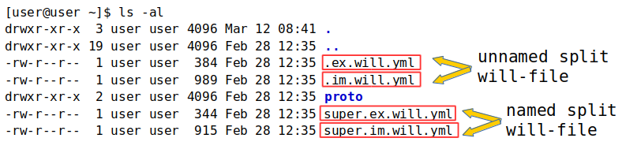

# Named and split `will-files`

### Named <code>will-file</code>

Kind of <code>will-file</code> which has a non-standard name. It makes possible to have multiple modules with different names in a directory.

`Will-file` name that looks like `.will.[extension]` is considered to be unnamed. At the same time, a directory may contain one unnamed `will-file` due to the name collision. The number of named` will-files` is not limited.

  

The figure shows the output of the `ls -al` command in the module directory of named `will-files`.

#### `.with` command for named `will-files`

To work with named `will-files` command [`.with`](../tutorial/WillFileNamed.md) is used.

#### An example of using the `.with` command

```
will .with final.release.will.yml .build release
```

Build command of the `release` build for the `will-file` named  `final.release.will.yml`.

#### `.each` command for named `will-files`

To work with a group of named `will-files` command [`.each`](../tutorial/CommandEach.md) is used.

### Split <code>will-file</code>

Splitting <code>will-file</code> into two files. One of them is for importing data and the other is for exporting. It makes possible to split data related building and to develop a module and data which can be used by another modules.

The resources which are described in one of the split `will-files` are available in the second. It eliminates the need to duplicate the data. Split can be implemented for named and unnamed `will-files`. By splitting the unnamed `will-files` the import file is called` .im.will.yml` and the export file is called `.ex.will.yml`.  

The structure of split of unnamed `will-files`:   

```
.
├── .im.will.yml    # import split-file
├── .ex.will.yml    # export split-file

```

The split of named `will-files` is different from the unnamed ones by name before the corresponding extension.  

```
.
├── first.im.will.yml    # import split-file
├── first.ex.will.yml    # export split-file

```

`Will-file` named `first` is split on `first.im.will.yml` import file and `first.ex.will.yml` export file.  

#### An example of two modules in one directory



The output of `ls -al` command in the module directory with the split of named and unnamed `will-file`.
