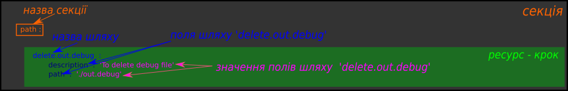
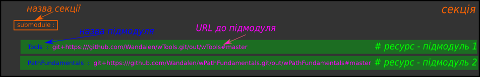

# Структура will-файла

В туторіалі описано структуру секцій `will`-файлу та приведено приклади їх застосування

<a name="structure"></a>

`Will`-файл - конфігураційний файл для побудови [will-модуля](Concepts.ukr.md#module). Може мати розширення '.yml', '.json', '.cson'. Структурно, файл скадається з секцій - заголовки першого рівня та їх [ресурсів](Concepts.ukr.md#resource) - заголовки другого рівня з власними полями.  
Структура `will`-файла з секціями.  

```
will-file
    ├── about
    ├── submodule
    ├── path
    ├── reflector
    ├── step
    ├── execution
    ├── exported
    └── build

```

Для `willbe` кількість і порядок чергування секцій не має значення тому, в залежності від призначення модуля, їх можна змінити. Наприклад:  

```
will-file
    ├── path
    ├── about
    ├── build
    └── submodule

```

### <a name="sections"></a> Опис секцій `will`-файла
<a name="about"></a> **About.** Секція will-файлу в якій поміщена основна інформація про модуль. Обов'язково заповнюється при експортуванні модуля.  

<a name="path"></a> **Path.** Ресурси секції (шляхи) створюють карту шляхів до файлів та директорій модуля. Секція має три вбудовані шляхи: `in`, `out` та `temp`. Директорія на яку вказує шлях `in` - точка відліку для відносних шляхів модуля, тобто,  `willbe` зчитує вказані шляхи починаючи з каталогу `in`, `out` - шлях до директорії для експортованих модулів, `temp` - шлях до директорії, де поміщаються тимчасові файли. Якщо шлях `in` не вказаний, то `willbe` починає відлік від кореневої директорії `will`-файла.   

<a name="submodule"></a> **Submodule.** Ресурси секції (підмодулі) вказують шляхи до окремих will-файлів готових [модулів](Concepts.ukr.md#submodule).  

<a name="step"></a> **Step** Ресурси секції (кроки) описують процедури для виконання пакетом `willbe`. Самостійно кроки не виконуються, їх поміщають в сценарії збірок секції `build`.    

<a name="reflector"></a> **Reflector.** Основними функціями ресурсів секції (рефлекторів) є файлові операції (вибір файлів (директорій), переміщення, копіювання і т.д.).   

<a name="execution"></a> **Execution.** Секція will-файлу яка описує варіанти виконання програми створення складної модульної системи (в стадії розробки).

<a name="exported"></a> **Exported.** Секція will-файлу яка присутня в автоматично згенерованому при експортуванні модуля `*.out.will`-файлі, де '\*' - будь-яка назва. `*.out.will` може бути використаний як підмодуль складної системи.  

<a name="build"></a> **Build.** Ресурси секції (збірки) описують послідовність і умови виконання процедур створення модуля. <a name="build-assembly-scenario"></a> **Сценарій збірки (Build assembly scenario).** Послідовність виконання кроків в збірці, яка може включати кроки користувача та вбудовані кроки пакету `willbe`.  

### <a name="resources"></a> Ресурси секцій  
<a name="resource"></a> Ресурсами вважаються внутрішні поля секцій will-файлу. При цьому ресурс поєднує як назву, так і значення цього поля. Кожна секція має власний набір полів.   
Розглянемо приклади секцій `will`-файлу:
<details>
  <summary><u> Приклади секцій 'path' та 'submodule' will-файлу</u></summary>



<p> </p>



</details>

<p></p>

Більше інформації про секції та ресурси в довідці ["Структура 'will'-файла"](WillFileStructure.ukr.md).

### Підсумок
Пакет `willbe` дозволяє [гнучко налаштовувати модулі](#structure) за рахунок структури `will`-файлу -[секцій](#sections) та їх [ресурсів](#resources).

[Повернутись до змісту](Topics.ukr.md)
