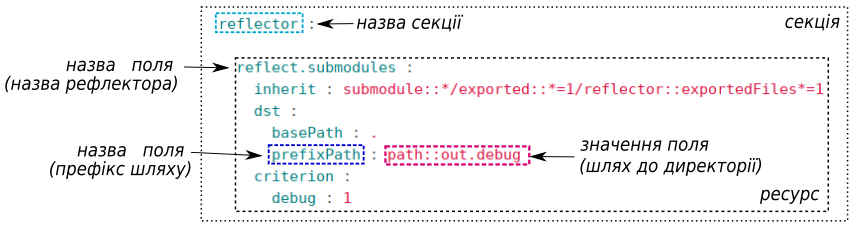

# Структура will-файлу

В туторіалі описано структуру секцій `will`-файлу та приведено приклади їх застосування

`Will`-файл - конфігураційний файл для побудови [will-модулю](Concepts.ukr.md#module). Може мати розширення '.yml', '.json', '.cson'.  Файл скадається з заголовків, які описують окремі функції та їх [ресурсів](Concepts.ukr.md#resource) (полів), що визначають поведінку функції. Заголовки першого рівня `will`-файла називаються секціями:  
```
will-file
    ├── about
    ├── submodule
    ├── path
    ├── reflector
    ├── step
    ├── execution
    ├── exported
    └── build

```
Ви можете змінити кількість і порядок чергування секцій `will`-файла в залежності від призначення модуля. Наприклад:
```
will-file
    ├── path
    ├── about
    ├── build
    └── submodule

```

### Опис секцій `will`-файла
<a name="about"></a> **About.** Секція will-файлу в якій поміщена основна інформація про модуль. Єдина секція яка при відсутності опису генеруєтся пакетом `willbe` автоматично.      

<a name="path"></a> **Path.** Секція, яка описує шляхи до директорій і файлів модулю.  

<a name="submodule"></a> **Submodule.** Секція, яка вказує на окремі will-файли готових [підмодулів](Concepts.ukr.md#submodule) для створення [супермодулю](Concepts.ukr.md#supermodule).  

<a name="step"></a> **Step** Описує процедури для виконання в секції `build` при створенні will-модулю. В секції записуються лише процедури користувача.  

<a name="reflector"></a> **Reflector.** Основною функцією є групування файлів модуля згідно [селектору](Concepts.ukr.md#selector) (зазвичай [ґлобу](Concepts.ukr.md#selector-with-glob)).   

<a name="execution"></a> **Execution.** Секція will-файлу яка описує варіанти виконання програми створення складної модульної системи (в стадії розробки).

<a name="exported"></a> **Exported.** Описує створення особливого виду will-модуля - нового will-файлу `*.out.will`, який може бути використаний як готове рішення або ж підмодуль складної системи.  

<a name="build"></a> **Build.** Секція will-файлу яка описує послідовність і умови виконання процедур створення модулю використовуючи значення секцій файлу та вбудованих функцій.  

### Зображення секцій зі складовими
<details>
  <summary><u>Схема секцій will-файлу</u></summary>
Секція 'path'

Секція 'submodule'

Секція 'reflector'


</details>
