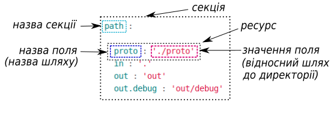
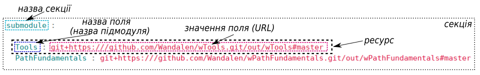

# Структура will-файла

В туторіалі описано структуру секцій `will`-файлу та приведено приклади їх застосування

`Will`-файл - конфігураційний файл для побудови [will-модулю](Concepts.ukr.md#module). Може мати розширення '.yml', '.json', '.cson'. <a name="structure"></a>  Файл скадається з заголовків, які описують окремі функції та їх [ресурсів](Concepts.ukr.md#resource) (полів), що визначають поведінку функції. Заголовки першого рівня `will`-файла називаються секціями:  
```
will-file
    ├── about
    ├── submodule
    ├── path
    ├── reflector
    ├── step
    ├── execution
    ├── exported
    └── build

```
Ви можете змінити кількість і порядок чергування секцій `will`-файла в залежності від призначення модуля. Наприклад:
```
will-file
    ├── path
    ├── about
    ├── build
    └── submodule

```

### <a name="sections"></a> Опис секцій `will`-файла
<a name="about"></a> **About.** Секція will-файлу в якій поміщена основна інформація про модуль. Єдина секція яка при відсутності опису генеруєтся пакетом `willbe` автоматично.      

<a name="path"></a> **Path.** Секція will-файлу яка описує шляхи до файлів та директорій модуля, має три вбудовані: `in`, `out` та `temp`. Директорія на яку вказує `in` - точка відліку для відносних шляхів модуля, тобто,  `willbe` зчитує вказані шляхи починаючи з каталогу `in`, `out` - експортовані файли, `temp` - тимчасові файли. Якщо `in` не вказаний, то `willbe` починає відлік від директорії `will`-файла.   

<a name="submodule"></a> **Submodule.** Секція, яка вказує на окремі will-файли готових [підмодулів](Concepts.ukr.md#submodule) для створення [супермодулю](Concepts.ukr.md#supermodule).  

<a name="step"></a> **Step** Описує процедури для виконання в секції `build` при створенні will-модулю. В секції записуються лише процедури користувача. (додати про шляхи)  

<a name="reflector"></a> **Reflector.** Основною функцією є групування файлів модуля згідно [селектору](Concepts.ukr.md#selector) (зазвичай [ґлобу](Concepts.ukr.md#selector-with-glob)).   

<a name="execution"></a> **Execution.** Секція will-файлу яка описує варіанти виконання програми створення складної модульної системи (в стадії розробки).

<a name="exported"></a> **Exported.** Секція will-файлу яка присутня в автоматично згенерованому `*.out.will`-файлі. `*.out.will` може бути використаний як підмодуль складної системи.  

<a name="build"></a> **Build.** Секція will-файлу яка описує послідовність і умови виконання процедур створення модулю використовуючи значення секцій файлу та вбудованих функцій.  

### <a name="resources"></a> Ресурси секцій  
<a name="resource"></a> Ресурсами вважаються внутрішні поля секцій will-файлу. При цьому ресурс поєднує як назву, так і значення цього поля. Кожна секція має власний набір полів.   
Розглянемо приклади секцій `will`-файлу:
<details>
  <summary><u> Приклади секцій 'path' та 'submodule' will-файлу</u></summary>



<p> </p>



</details>

<p></p>
Більше інформації про секції та ресурси в довідці ["Структура 'will'-файла"](WillFileStructure.ukr.md).

### Підсумок
Пакет `willbe` дозволяє [гнучко налаштовувати модулі](#structure) за рахунок структури `will`-файлу -[секцій](#sections) та їх [ресурсів](#resources).

[Повернутись до меню](Topics.ukr.md)
