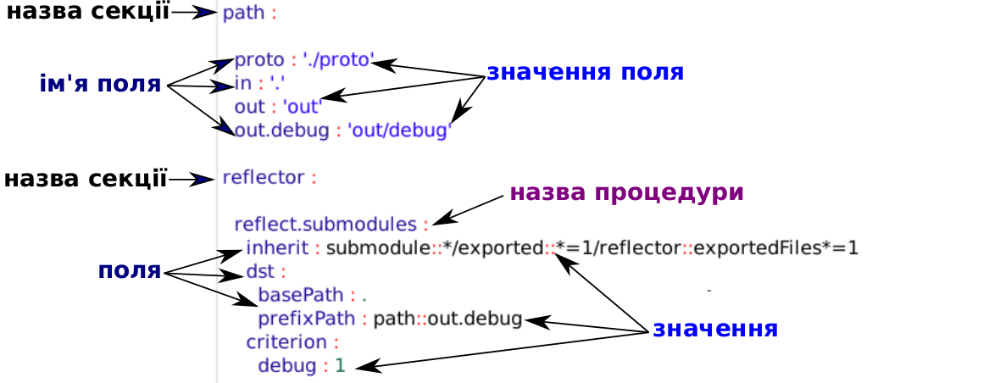

# Структура will-файлу

В туторіалі описано структуру функціональних секцій `will`-файлу та приведено приклади їх застосування

`Will`-файл - конфігураційний файл для побудови [will-модулю](Concepts.ukr.md#module). Може мати розширення '.yml', '.json', '.cson'. `Will`-документ скадається з заголовків та [ресурсів](Concepts.ukr.md#resource) (полів). Заголовоки першого рівня в will-документі - [секції](Concepts.ukr.md#will-file-section) - описують окремі функціональності модуля.  
Структура секцій will-файлу  
```
.will.yml
    ├── about
    ├── submodule
    ├── path
    ├── reflector
    ├── step
    ├── execution
    ├── exported
    └── build

```
Набір і послідовність секцій варіативні і залежать від призначення модуля. Нижче приведено дві секції з ресурсами:
<details>
  <summary><u>Схема секцій will-файлу</u></summary>



</details>

<a name="about"></a> **About.** Секція will-файлу в якій поміщена основна інформація про модуль. Єдина секція яка при відсутності опису генеруєтся пакетом `willbe` автоматично.     
Структура полів секції `about`:

| Поле           | Опис                                    |
|----------------|-----------------------------------------|
| name           | назва модуля; необов'язкове поле        |
| description    | опис (коротка характеристика модуля) - призначення, ліцензія, автори та ін.; необов'язков поле    |
| version        | версія модуля - для позначення прогресу розробки та стану готовності продукту; необов'язков поле  |
| enabled        | стан відображення блоку; обов'язков поле; значення за замовчуванням '1' |
| interpreters   | інтерпретатор модуля; необов'язков поле |
| keywords       | ключові слова; необов'язков поле        |  

<a name="path"></a> **Path.** Секція will-файлу яка описує шляхи до директорій і файлів модулю.  
Структура полів секції `path` за замовчуванням:  

| Поле           | Опис                                    |
|----------------|-----------------------------------------|
| path           | шлях до директорії виконання описаної процедурами в `build` (абсолютний, відносний); обов'язкове поле |
| description    | коротка характеристика створеної директорії; необов'язкове поле    |
| criterion      | критерій створення директорії; необов'язкове поле                  |
| inherit        | наслідування умов створення директорій або вибору файлів (за описаний сценарієм); необов'язкове поле  |  

<a name="submodule"></a> **Submodule.** Секція will-файлу яка вказує на окремі will-файли готових модулів (підмодулів) створюваного модулю (супермодулю).  
Структура полів секції `submodule` за замовчуванням:  

| Поле           | Опис                                   |
|----------------|----------------------------------------|
| path           | шлях до підмодуля (абсолютний, відносний, URL); необов'язкове поле |
| description    | коротка характеристика підмодуля; необов'язкове поле               |
| criterion      | критерій роботи підмодуля; необов'язкове поле                      |
| inherit        | наслідування підмодулем. Якщо вже є описаний підмодуль, можливо включити наслідування властивостей; необов'язкове поле          |  

<a name="step"></a> **Step** Секція will-файлу яка описує можливі процедури для використання в секції `build` при створенні will-модулю. Проте в цій секції можуть описуватися не всі процедури, оскільки деякі вбудовані в пакет `willbe`.  
Структура полів секції `step` за замовчуванням:   

| Поле           | Опис                                   |
|----------------|----------------------------------------|
| description    | коротка характеристика кроку (процедури); необов'язкове поле       |
| criterion      | критерій роботи процедури; необов'язкове поле                      |
| opts           | опції виконання процедурий; необов'язкове поле                     |
| inherit        | наслідування процедур. Якщо вже є описана процедура або рефлектор, можливо включити наслідування властивостей; необов'язкове поле          |  

<a name="reflector"></a> **Reflector.** Секція will-файлу основною функцією є групування файлів модуля згідно селектору (зазвичай [ґлобу](Concepts.ukr.md#selector-with-glob)).   
Структура полів секція `reflector` за замовчуванням:  

| Поле           | Опис                                   |
|----------------|----------------------------------------|
| description    | коротка характеристика рефлектору, його призначення; необов'язкове поле |
| recursive      | умова замикання процедури вибору файлів на себе; необов'язкове поле     |
| filePath       | шлях до директорії з файлами (абсолютний, відносний); обов'язкове поле  |
| src            | ресурси (шляхи) звідки буде зчитано файли; необов'язкове поле           |
| dst            | директорія в яку будут поміщено файли; обов'язкове поле                 |
| criterion      | критерій виконання рефлектору; необов'язкове поле                       |
| inherit        | наслідування вибірки рефлектором. Якщо вже є описане поле в іншому блоці, можливо включити його наслідування; необов'язкове поле          |

<a name="execution"></a> **Execution.** Секція will-файлу яка описує варіанти виконання програми створення складної модульної системи.  
<a name="exported"></a> **Exported.** Секця will-файлу яка описує створення особливого виду will-модуля - нового will-файлу `*.out.will`, який може бути використаний як готове рішення або ж підмодуль складної системи.  
Структура полів секції `exported` за замовчуванням:  

| Поле                     | Опис                                   |
|--------------------------|----------------------------------------|
| version                  | версія модуля - для позначення прогресу розробки та стану готовності продукту; необов'язков поле |
| description              | опис (коротка характеристика модуля) - призначення, ліцензія, автори та ін.; необов'язков поле   |
| criterion                | критерій виконання створюваного модуля; обов'язкове поле                                         |
| inherit                  | наслідування в експортованому файлі. Можливо включити наслідування властивостей блоків і полів вихідного файлу; необов'язкове поле          |
| exportedReflector        | рефлектор, який діє в експортованому will-файлі                 |
| exportedFilesReflector   | рефлектор, на експортовані файли                                |  
| exportedDirPath          | експортовані шляхи директорій для створення модулю              |
| exportedFilesPath        | експортовані шляхи файлів для створення модулю                  |
| archiveFilePath          | експортовані шляхи для архівованих файлів створеного модулю     |

<a name="build"></a> **Build.** Одна з найважливіших секцій will-файлу яка описує послідовність процедур створення модулю на основі значень в полях попередніх функціональних секціях та вбудованих функцій.  
Структура полів секції `build` за замовчуванням:  

| Поле          | Опис                                    |
|---------------|-----------------------------------------|
| description   | пояснення до збірки модуля; необов'язковий поле                 |  
| criterion     | критерій виконання створюваного модуля; обов'язкове поле        |
| steps         | процедури, які будуть використовуватись при створенні модулю. Процедури можуть бути не прописані в блоці `step`, а вбудовані в пакет; обов'язкове поле |
| inherit       | наслідування збірником. Якщо вже є описана процедура, можливо включити її наслідування; необов'язкове поле          |  

### <a name="examples"></a> Приклади will-файлів

<details>
  <summary><u>Найпростіший will-файл з функцією встановлення пакетів NodeJS</u></summary>

```yaml

about :

  name : first
  description : "First module"
  version : 0.0.1

step :

  npm.install :
    currentPath : '.'
    shell : npm install

build :

  debug:
    criterion :
      default : 1
    steps :
      - npm.install
```

Детальніше в розділі [First will-file](First_will_file.md)
</details>

<details>
  <summary><u>Will-файл з функцією експорту</u></summary>

```yaml

About
  name : 'listing'
  description : 'Module for listing'
  version : '0.0.1'
  enabled : 1

Paths
  in : 'in'
  out : 'out'
  export : 'proto'

step::export.proto
  opts :
    tar : 0
    export : path::export
  inherit :
    export

build::export
  criterion :
    default : 1
    export : 1
  steps :
    export.proto
```
</details>


<details>
  <summary><u>Will-файл з експорту локального модуля</u></summary>

```yaml

about :

  name : semantic-ui
  version : 2.0.7

path :

  out : '.'
  export : '.'

step  :
  export.semantic :
      inherit : export
      tar : 0
      export : path::export

build :
  export :
      criterion :
          default : 1
          export : 1
      steps :
          - export.semantic  
```

</details>

### <a name="conclusion"></a> Підсумок
В цьому розділі описані всі секції `will`-файлу та їх поля за замовчуванням. `Will`-файл в залежності від призначення може містити лише окремі секції з наведеного списку.  
[Секція `about`](#about) має визначену структуру і повинна бути присутня в `will`-файлі. Якщо не описати цю секцію, `willbe` автоматично згенерує її з єдиним встановленим параметом.  
Приведено [декілька конфігурацій](#examples) `will`-файлів.

[Повернутись до меню](Topics.md)
