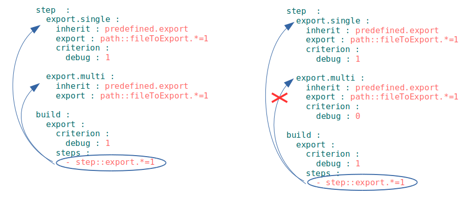

# Glob with assert

Restriction the numbers of the resources, which should be found by selector with glob.

Assert - is a special structure, which allows checking of assumption about the value of arbitrary data in arbitrary place of the program. By construction of the module the data come down to resources of `will-file` and it is assumed, that selector chooses given (programmed) number of resources. If simple selectors were used, it means, that assumption is correct, but in case of glob using mistake is possible. Thus utilization of globes with asserts is  highly recommended.
Glob with assert means restriction of the sample of selector with globe by numeric value for localization of place of mistake and prevention of implementation unwanted actions. At the figure is shown simplified algorithm of verification of input's amount.  

Assert is wrtitten after glob and has is represented by `=n`, with `n` - number of inputs. For instance, in majority of cases, selector has to choose one resource of section `will-file` and therefore assert '=1' is used.

  

At the figure selector `step::export.*` in build  `export` can implement steps `export.single` and  `export.multi`. Due to mistake in `will-file` (lack of criterions in step `export.multi` - see criterion) construction will be broken, since in one step in scenario of build a step in section `step` is implemented. Without asserts utility `willbe` will produce a message with mistake, which will be difficult to localize, but by using asserts in terminal, the message about place and resources in which the error appears is displayed.

     

Developer restricted the number of file inputs, which begins from `fileTo` by five files as well(pole `path: 'fileTo*=5'` in path `fileToExport.multi`). If number of inputs is altered, construction will be cancelled.
