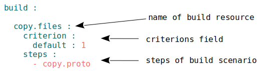

## Ресурс збірка

Послідовність і умови виконання процедур побудови модуля. При виконанні команди `.build` розробник має вказати збірку, яку хоче зібрати, однозначно вибравши одну по імені або по умовам вибірки.

Найважливішим полем збірки є `steps` - сценарій збірки. Сценарій збірки - послідовність кроків, що потрібно виконати для того щоб збірка вважалася побудованою.

### Приклад

Приклад має ...

### Збірка за замовчуванням

Модуль може мати збірку за замовчуванням. Для того щоб зробити якусь збірку такою потрібно вказати для неї критеріон `default : 1`.

### Поля ресурсів секції `build`  

| Поле          | Опис                                                             |
|---------------|------------------------------------------------------------------|
| description   | опис для інших розробників                                       |
| criterion     | умова побудови модуля (див. [критеріон](Criterions.md))          |
| steps         | послідовність кроків, що потрібно виконати для того щоб збірка вважалася побудованою ви                  |
| inherit       | наслідування від іншої збірки                        |

### Секція <code>build</code>

Ресурси секції (збірки) описують послідовність і умови виконання процедур створення модуля.  
