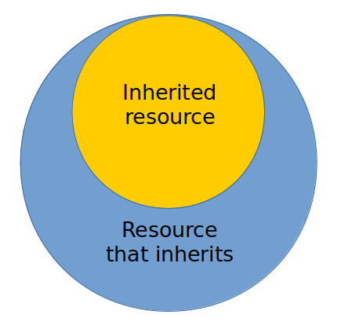

# Resources inheritance  

Approach of description of a module according to wich <code>will-file</code> can reuse (inherit) value of fields of other resource(s) of the same type.

При наслідуванні ресурс, здатен змінювати і доповнювати наслідуваний ресурс.  
Наслідування ресурсами доволяє повторно використовувати ресурси `will-файла`, побудовані користувачем і згенеровані при експорті модуля, що спрощує побудову модуля.  
На діаграмі зображено як відносяться ресурс, що наслідується і ресурс, який наслідує.

### Властивості:   
- ресурс, який наслідує може змінити ресурс, який наслідується;  
- ресурс, який наслідує може доповнити ресурс, який наслідується;  
- є ресурси, які приймають параметри - критеріони, шляхи, тощо;
- параметри задаються в ресурсі, який наслідує.  

### Використання наслідування ресурсами  
Для використання наслідування ресурсами в межах одного `will-файла` потрібно:  
- вказати ресурс який буде наслідуватись;  
- за необхідністю, змінити або доповнити поля ресурса.  
Для використання наслідування ресурсами з іншого `will-файла`:  
- підключити сторонній `will-файл` як підмодуль в секції `submodule`;  
- вказати в полі `inherit` шлях до ресурса, який буде наслідуватись. Шлях має формулювання: `submodule::NameOfSubmodule/section::NameOfSection/NameOfResource`, тобто, явно вказується підмодуль, секція і ресурс;  
- за необхідністю, вказати критеріони і доповнити поля ресурса.  
