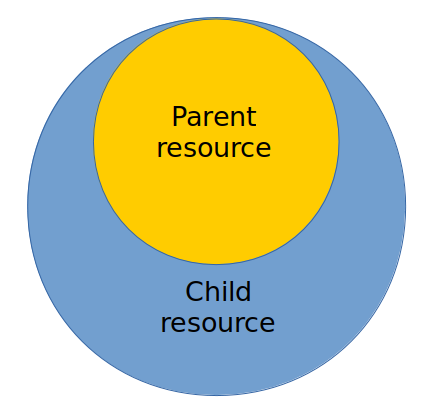

# Inheritance

It is the approach of the module description according to which the <code>willfile</code> can reuse (inherit) field values of another resource(s) of the same type.

By inheritance, it is possible to supplement the child resource by the new values of the fields which the parent did not have, or these fields of the parent had a different value. The inheritance allows reusing the resources of the `willfiles`, which simplifies the development and design of the modules.

The diagram shows the relation between the resource which is followed by the resource which follows.

### Use of the resources which belong to the same module

For the inheritance within the borders of one `willfile`:

- specify the parent resource which will be followed in the field `inherit` of the child resource. For example `inherit : reflector::some` ;
- if needed, change or supplement the field of resource

### Use of the resources which belong to the different module

For the use of inheritance by resources from another `willfile`:

- connect outside `willfile` as a submodule of the section `submodule`;
- specify in the field `inherit` the selector to the resource, which will be followed. For example `inherit:submodule::NameOfSubmodule/section::NameOfSection/NameOfResource`, which means that submodule, section and resource are specified clearly;
- if needed, specify criterions and supplement the fields of the resource for the child resource.
