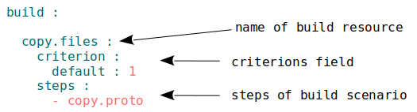

## Resource build

Sequence and conditions of procedures execution to build a module. By implementation of the command `will .build`, developer has to select a particular build which is wanted unambiguously calling command by name or by conditions of the build.

Найважливішим полем збірки є `steps` - сценарій збірки. Сценарій збірки - послідовність кроків, що потрібно виконати для того щоб збірка вважалася побудованою.

The most important the field of the build  is `steps` - a build script. Build script is a sequence of steps that must be performed consider the build constructed.

### Build by default

  Модуль може мати збірку за замовчуванням. Для того щоб зробити якусь збірку такою потрібно вказати для неї

The module may have a default build. In order to make a such a build it is needed to specify for her
  [cryterion `default : 1`](Criterions.md#Використання).

### Example



The build with the name `copy.files` has one step `copy.proto`. Criterion `default : 1` makes this build the default build.

### The fields of resources of section `build`  

| Field        | Description                                                            |
|---------------|------------------------------------------------------------------|
  | description   | description for other developers                                    |
| criterion     | condition of module construction (see [criterion](Criterions.md))          |
| steps         | sequence of steps to be performed in order to consider the build being constructed        |
| inherit       | inheritance from another collection                       |

### Resource export

Особливий вид збірки необхідний для використання даного модуля іншими розробниками та модулями. Результатом експортування модуля є аретфакти, зокерма <code>out-will-file</code>.

A special kind of build which is needed to use this module by other developers and modules. The result of the module export are generated files, which is <code> out-will-file </ code> and archive.

Результатом експорту модуля є згенерований конфігураційний `out-will-file` та, опціонально, архів з файлами модуля. При експортуванні модуля заповнення секції about обов'язкова і вона повинна мати ім'я та версію модуля.

The result of the module exportation is the generated configuration `out-will-file`  and optionally the archive with the module files. While exporting the module, filling out the section `about` is required and must have the name and version of the module.

 Процес експортування `*.out.will.`-файла включає як копіювання інформації з поточного модуля, так і додавання сервісної інформації для імпорту. При експортуванні модуля заповнення секції `about` обов'язкове.  
Експорт модуля здійснюється з допомогою [вбудованого кроку `predefined.export`](ResourceStep.md#вбудований-крок-predefinedexport).  

### Приклад збірки експорту

```yaml
build :

  export :
    criterion :
      default : 1
      export : 1
    steps :
	  - export.files
```

В збірці `export` використовується крок `export.files` для експортування файлів. Поєднання критеріонів `export` i `default` дозволяє призначити [збірку експорту за замовчуванням](Criterions.md#Використання).

### Секція <code>build</code>

Ресурси секції (збірки) описують послідовність і умови виконання процедур створення модуля.  
