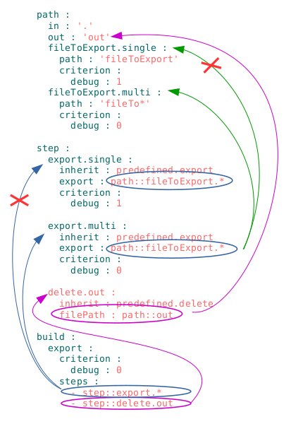

### Selector

String-reference on resource or group of resources of the module.

### Selector with globe

[Globbing](https://linuxhint.com/bash_globbing_tutorial/) - it is an analogue of regular expressions for searching files in the bash-terminal.

#### Example of sections `will-file` with selectors

The two build of selectors are used in the drawing `export`. The `step::export.*` selector is the glob because it contains `*`, it reads: "select all steps that begin with `export`".This selector can select steps `:: export.single` and `step :: export.multi` (indicated by blue arrows).The choice of a step is carried out by [comparing the map of criterion](Criterions.md). Similarly, the paths are selected by steps `export.single` and `export.multi`.

The selectors `step :: delete.out` in the build` export` and `path :: out` in the` delete.out` step are simple - have a direct link to the resource. In `will-file` selectors of the form` Section name :: The name of the resource` are used.

### Glob with assertor

A special syntactic construction that is added to the glob in order to limit the amount of resources which have to be found by the selector with this globe.

The `step::export` step must choose one way `path::out.debug`. Since it is the predictable and expectable result, developer put in selector `path::out.*=1` assert `=1`. This will ensure that the error is shown, if it happens, and more or less of  one path will be found by this selector. For example, if in paths do not specify a debug criterion, both paths will be found and an assert will show the error.

It is possible to find more than one or even none of the resource by selector with globe. If the developer knows how many selector with the globe can find the resources, he can specify this number as an assert in the selector. Then while performing the utility notices that the developer's forecast is not confirmed and consequently will show the error. Leave asserts everywhere, where it is exactly known which the result of execution is - good practice of software development. Globe with assert is the specially enforced implementation by the developer to prevent unpredictable consequences. If the selector is simple and has no globe, then assert is not needed.

#### Algorythm of verification asserts in selectors

The algorithm performs a verification of the resources on the map coincidence [criterions](Criterions.md) - when they coincide, the utility increments the counter of resources. After verifying all resources, the value of the counter is compared to the one which is set in the assert. In case of non-matching values, the utility shows an error message.

### Use of asserts

  

The figure on the left shows a variant of the resource's erroneous writing. Because of the lack of criterions in the step`export.multi` selector `step::export.*=1` in build `build::export` will choose `step::export.single` and `step::export.multi`steps, which is contrary to the developer's expectation. Thanks to assert `= 1` the error will be localized.

  

Error message in resources selection for the `will-file` due to the assert's triggering.
