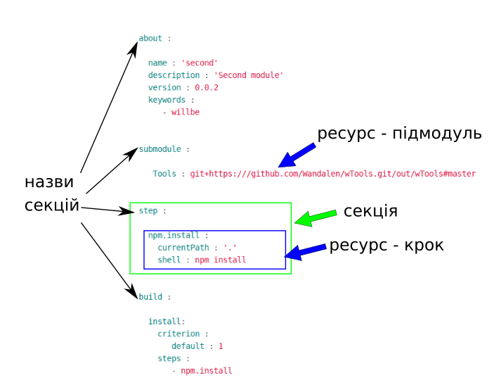

# Внутрішня будова

### Секція <code>will-файла</code>  

Вища структурна одиниця <code>will-файла</code>, яка складається з ресурсів одного типу або полів, що описують даний модуль.

Для побудови модуля існує 6-ть секцій: `about`, `path`, `submodule`, `step`, `reflector`, `build` та одна секція, яка лише генерується при експорті модуля - секція `exported`.   

Схематична структура `will-файла` по секціями:

```
will-file
    ├── about
    ├── submodule
    ├── path
    ├── reflector
    ├── step
    ├── build
    └── exported

```

Жодна із секцій не є обов'язковою для використання `will-файла`. Втім для виконання окремих команд необхідна присутність деяких. Наприклад для експортування модуля воно повинно мати ім'я і версі, котрі задаються в секції `about`.

### Призначення секцій `will-файла`

<details>
  <summary><a href="./concept/SectionAbout.md">Секція <code>about</code></a></summary>
  Секція містить описову інформація про модуль.
</details>
<details>
  <summary><a href="./concept/ResourcePath.md#Секція-path">Секція <code>path</code></a></summary>
  Секція містить перелік шляхів модуля для швидкого орієнтування в його файловій структурі.
</details>
<details>
  <summary><a href="./concept/Submodule.section.md">Секція <code>submodule</code></a></summary>
  Секція містить інформацію про підмодулі.
</details>
<details>
  <summary><a href="./concept/ResourceStep.md#Секція-step">Секція <code>step</code></a></summary>
  Секція містить кроки, які можуть бути застосовані збіркою для побудови модуля.
</details>
<details>
  <summary><a href="./concept/ResourceReflector.md#Секція-reflector">Секція <code>reflector</code></a></summary>
  Секція містить рефлектори - ресурси для виконання операцій над групами файлів.
</details>
<details>
  <summary><a href="./concept/ResourceBuild.md#Секція-build">Секція <code>build</code></a></summary>
  Ресурси секції (збірки) описують послідовність і умови виконання процедур створення модуля.
</details>
<details>
  <summary><a href="./concept/SectionExported.md">Секція <code>exported</code></a></summary>
  Секція <code>out-will-файла</code>, програмно генерується при експортуванні модуля, містить перелік всіх експортованих файлів та використовується при імпортуванні даного модуля іншим.
</details>

### Приклад `will-файла`:  

  

На рисунку можна бачити `will-файл` з 4-ма секціями та декількома ресурсами.

### Ресурси

Структурна і функціональна одиниця <code>will-файла</code>. В файлі ресурси одного типу зібрані в одній секції.  

Ресурси секцій позначаються декларативно, тобто, вказується бажаний результат, а не послідовність інструкцій для отримання цього результату.

Вигляд ресурсів окремих секцій відрізняється.
  
На рисунку ресурс типу підмодуль `Tools` розміщений в секції `submodule` має скорочену форму запису, а ресурс типу крок `npm.install` розміщеий в секції `step` має повну (розширену) форму запису.

### Тип ресурса

Функціональність пов'язана із групою ресурсів, обмежена призначенням. Приклад того, які бувать типи ресурів: шлях, підмодуль, крок, збірка. Кожен тип ресурів має власне призначення і обробляється утиілітою по-різному.

### Ресурси по типам

<details>
  <summary><a href="./ResourcePath.md.md#Ресурс-шлях">Ресурси типу <code>path</code></a></summary>
  Описують файлову структуру модуля, вказуючи шляхів до файлів даного модуля.
</details>
<details>
  <summary><a href="./ResourceStep.md#Ресурс-крок">Ресурси типу <code>step</code></a></summary>
  Ресурс секції <code>step</code>, який представляє собою інструкцію для виконання утилітою при побудові модуля. Описують операції та бажаний результат. Збірки складаються із кроків.
</details>
<details>
  <summary><a href="./ResourceReflector.md#Ресурс-рефлектор">Ресурси типу <code>reflector</code></a></summary>
  Призначені для вибірки групи файлів для здійснення над ними якоїсь операції.
</details>
<details>
  <summary><a href="./SubmodulesLocalAndRemote.md">Ресурси типу <code>submodule</code></a></summary>
  Є посиланнями на інші модулі, які можливо використати в якості підмодулів даного модуля.
</details>
<details>
  <summary><a href="./ResourceBuild.md#Ресурс-збірка">Ресурси типу <code>build</code></a></summary>
  Містять перелік кроків, котрі потрібно здійснити щоб збудувати модуль.
</details>
<details>
  <summary><a href="./Export.md#Експорт-модуля">Ресурси типу <code>export</code></a></summary>
  Це особливий вид збірки, результатом виконання, якої є згенерованй `out-will-файл`, що може бути використаний іншим модулем.
</details>
<details>
  <summary><a href="./SectionExported.md#Секція-exported">Ресурси типу <code>exported</code></a></summary>
  Цей ресурс генерується при експортуванні модуля і наявний лише в згенерованих файлах. <code>out-will-файл</code> має рівно стільки ресурсів типу <code>exported</code> скільки разів було виконано експортування даного модуля для різних експортів. Ресурси цього типу включають описові поля і перелік експортованих файлів.
</details>
