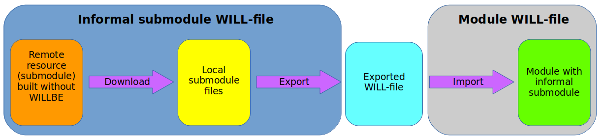

# Informal submodule

Set of files distribution of which does not include <code>will-file</code>.For such a submodule it is possible to create <code>will-file</code> independently.

To connect a submodule which is created without using the `willbe` utility, one needs to create its export configuration and place the link at the local exported file in the section` submodule`. The advantage of creating a separate `will file` for an informal submodule is the possibility to automatically build and update it.

### Procedure of importing an informal submodule

The figure shows the general sequence of the creation of the informal submodule. The `Will-file` of the informal submodule combines operations of downloading files from a remote server and exporting of the local submodule. The `will file` of the module imports the exported local submodule.
