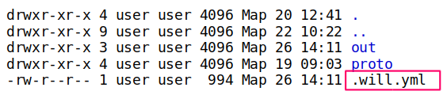

# <code>Will-file</code>  

Config for describing and building a module. Each formal module has such file.  

`Will-file` must be created for [informal submodules](SubmoduleInformal.md). It is convenient to use informal submodules. 

`Will file`:  
- describes the [module](Module.md#Module) files;  
- the document consists of sections and resources;  
- [section](Structure.mdSection-will-file) is the highest structural element of `will-file`;  
- [resource](Structure.mdResources) is structural and functional element of `will-file`;  
- resources describe the functionalities of the module;  
- section consists of single type resources;  
- can be [named and unnamed](WillFileNamedAndSplit.md#Named-will-file);  
- can be [split](WillFileNamedAndSplit.md#Split-will-file) into two files for convenient use;
- may be [generated (`out-will-file`)] (Export.md#Exported-will-file-out-will-file) or written manually;
- generated `out-will-file` can be imported as a submodule;
- resources can be reused through [inheritance](Inheritance.md).

The following `will-file` extensions are supported:
- `.yml`,
- `.json`,
- `.cson`.  

### An example of the file structure of the module

The figure shows the list of files in the module directory (the `ls -al` command output). `Will-file` marked by rectangle.

### An example of `will-file`

The `will-file` structure and its elements.
