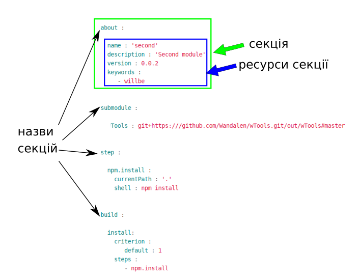
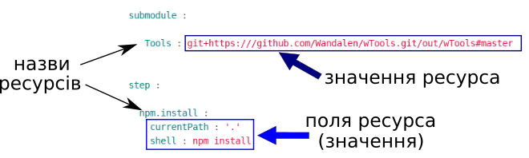

# Внутрішня будова 

### Секція
**Секція** - вища структурна одиниця `will-файла`, яка складається з ресурсів одного типу. Є шість секцій для побудови модуля користувачем: `about`, `path`, `submodule`, `step`, `reflector`, `build` та одна секція, яка генерується утилітою `willbe` при експорті модуля - секція `exported`. Порядок розташування і кількість секцій в `will-файлі` визначається його призначенням.  
Приклад `will-файла`:  

  

### Ресурси
**Ресурси** - елементи `will-файла`, які позначають певну функціональність. Ресурси секцій позначаються декларативно, тобто, вказується лише результат, який потрібно отримати, а послідовність дій для отримання результату опускається.  
Вигляд ресурсів окремих секцій відрізняється. На рисунку ресурс `Tools` секції `submodule` має скорочену форму запису, а ресурс `npm.install` секції `step` - повну (розширену):

