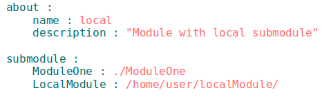

# Локальні і віддалені підмодулі

### <a name="local-submodule"></a> Локальний підмодуль  
**Локальний підмодуль** - підмодуль, який розташовується на машині користувача.  
Будь-який модуль, який розташовується на локальній машині можна підключити як підмодуль в новому `will-файлі`. Для підключення підмодуля в секції `submodule` вказується ресурс з шляхом до `will-файла` іншого модуля (створеного користувачем або експортованого). Для підключення локального підмодуля краще використовувати експортовані `some_name.out.will`-файли, оскільки вони містять інформацію про модуль і збірки по яким він побудований.  



Схема модуля з локальними підмодулями  

```
.
├── local_modules
│       ├──local_files          # файли локального підмодуля
│       └──local.will.yml       # конфігураційний файл локального модуля
└── .will.yml                   # конфігураційний файл модуля

```  


### <a name="remote-submodule"></a> Віддалений підмодуль  
**Віддалений підмодуль** - модуль, який знаходиться на віддаленому сервері, для використання завантажується на локальну машину.  