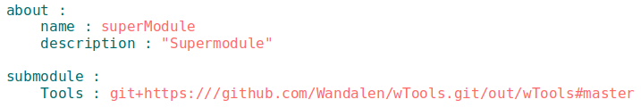

# Модуль, підмодуль, супермодуль

### <a name="module"></a> Модуль 
**Модуль** - сукупність файлів, які описані в `will-файлi`.  
На рисунку приведений код `will-файла`, номерами і стрілками позначено як його читати (спрощена схема).  


1. В секції `about` (якщо вказана) поміщено опис модуля - назва, версія, опис, інтерпретатори і ключові слова - інформація для розробника. На даному рисунку вказано, що модуль називається `exportModule`, версія - 0.0.1, він призначений для експорту одного файла.   
2. Щоб визначити функціональність модуля, починайте зчитування з секції `build`, яка присутня в більшості `will-файлiв`. В секції `build` поміщено збірки побудови модуля. На рисунку збірка з назвою `export` виконує крок з назвою `export.single` (стрілкою вказано перехід до кроку).  
3. Крок `export.single` виконує експорт. В полі `export` крок посилається на ресурс секції `path` з назвою `fileToExport` (стрілкою вказано перехід до шляху). В ресурсах прийнято формулювати посилання `Назва секції :: Назва ресурса`.
4. Ресурс `fileToExport` секції `path` вказує на файл з назвою `fileToExport` в директорії модуля.   
Для визначення структури файлів без уточнення умов функціонування модуля звертайтесь до секції `path` проминувши інші кроки. В секції `path` є три вбудовані шляхи:  
`in` - директорія, відносно якої будуються шляхи модуля;  
`out` - директорія для експортованого `will-файла`;  
`temp` - директорія, де поміщаються тимчасові файли.  

Інші шляхи в секції вказують на файли і директорії користувача.  

Відповідно, структура модуля з вказаним `will-файлом` має вигляд:  

```
.  
├── fileToExport               # файл модуля
└── .will.yml                  # конфігураційний файл модуля

``` 

### <a name="submodule"></a> Підмодуль  
**Підмодуль** - окремий модуль з власним конфігураційним `will-файлом`, який підпорядковується іншому модулю (супермодулю). 

### <a name="supermodule"></a> Супермодуль
**Супермодуль** - це модуль, який включає в себе інші модулі (підмодулі).  
Для підключення підмодуля в секцію `submodule` `will-файлa` поміщається ресурс з посиланням на `will-файл` підмодуля.  
На рисунку показана частина `will-файла`, що описує супермодуль з назвою `superModule`. В секцію `submodule` поміщений підмодуль `Tools` з посиланням на віддалений сервер: 



Детальніше про підмодулі в концепціях ["Локальний підмодуль"](LocalAndRemoteSubmodules.md#local-submodule) ["Віддалений підмодуль"](LocalAndRemoteSubmodules.md#remote-submodule)