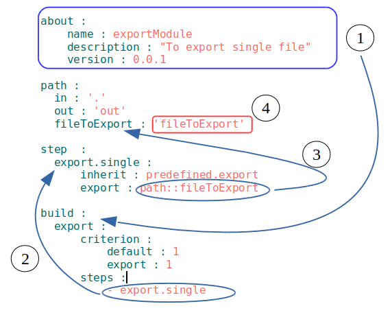

# Модуль, підмодуль, супермодуль

### <a name="module"></a> Модуль 
**Модуль** - сукупність файлів, які описані в `will-файлi`.  



На рисунку приведений `will-файл`, номерами і стрілками позначено як його читати (спрощена схема).  
1. В секції `about` (якщо вказана) поміщена інформація про модуль - назва, версія, опис, інтерпретатори і ключові слова - інформація для розробника.  
2. Секція `build` присутня в більшості `will-файлiв`, вона поміщає збірки побудови модуля. На рисунку збірка з назвою `export` виконує крок з назвою `export.single` (стрілкою вказано переіхід).  
3. Крок `export.single` виконує експорт. В полі `export` крок `export.single` посилається на ресурс секції `path` з назвою `fileToExport` (стрілкою вказано переіхід).
4. Ресурс `fileToExport` секції `path` вказує на файл з назвою `fileToExport` в директорії модуля. 
Структура модуля має вигляд:  

```
.  
├── fileToExport               # файл модуля
└── .will.yml                  # конфігураційний файл модуля

```  

### <a name="submodule"></a> Підмодуль  
**Підмодуль (Submodule).** Окремий модуль з власним конфігураційним will-файлом, який підпорядковується іншому модулю (супермодулю). 

### <a name="supermodule"></a> Супермодуль
**Супермодуль (Supermodule).** Відносне поняття між модулями системи при якому поточний модуль є базовим по відношенню до нащадка (підмодуля).  
Схема супермодуля

```
.
├── .module
│      ├── submodule_files           # файли підмодуля
│      └── submodule.will.yml        # конфігураційний файл підмодуля (модуля)
└── .will.yml                        # конфігураційний файл супермодуля

```