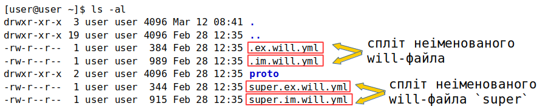

# Іменовані і розділені `will-файли`

### <a name="named-will-file"></a> Іменований `will-файл`

**Іменований `will-файл`** - вид `will-файла` назва якого починається з імені - буквенних і цифрових символів. `Will-файл`, назва якого має вигляд `.will.[розширення]` вважається неіменованим.  
В директорії одночасно може знаходитись один неіменований `will-файл` та необмежена кількість іменованих. Для роботи з іменованими `will-файлами` використовується команда `.with`. Приклад: фраза побудови збірки `release` в іменованому `will-файлі` `final.release.will.yml` матиме вигляд `will .with final.release.will.yml .build release`.  
На рисунку показаний вивід команди `ls -al` в директорії модуля з іменованими `will-файлами`:  

  

### <a name="split-will-file"></a> Розділені `will-файли`
**Спліт will-файл** - розділення `will-файла` на два файла - для імпорту та експорту модуля, що дозволяє розробнику розділити процес побудови модуля і його експорту на окремі етапи. Ресурси описані в одному з розділених `will-файлів` доступні в другому, що позбавляє необхіності дублювати дані. Спліт можливий як для неіменованого файла, так і для іменованого. При розділенні неіменованих `will-файлів`, файл імпорту називається `.im.will.yml`, а файл експорту - `.ex.will.yml`.  
Структура розділених неіменованих `will-файлів`:   

```
.
├── .im.will.yml    # спліт-файл імпорту 
├── .ex.will.yml    # спліт-файл експорту

```  

Спліт іменованих `will-файлів` відрізняється від неіменованих ім'ям перед відповідним розширенням. Наприклад `will-файл` з назвою `first` буде розділений на `first.im.will.yml` для файлу імпорту і  `first.ex.will.yml` для файла експорту:  

```
.
├── first.im.will.yml    # спліт-файл імпорту
├── first.ex.will.yml    # спліт-файл експорту 

``` 

Вивід команди `ls -al` в директорії модуля зі сплітом іменованого та неіменованого `will-файла`: 

 