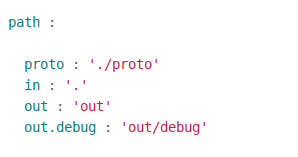

# Секція `path`
Секція представляє карту шляхів модуля для швидкого орієнтування в його структурі. Секція має три вбудовані шляхи: `in`, `out` та `temp`. Директорія на яку вказує `in` - точка відліку для відносних шляхів модуля, тобто, утиліта `willbe` зчитує шлях до ресурсу відносно каталогу `in`, `out` - директорія для експортованих модулів, `temp` - поміщаються тимчасові файли. Якщо `in` не вказаний, то `willbe` починає відлік від кореневої директорії `will`-файла.  

### Поля ресурсів секції `path`     

| Поле           | Опис                                        |
|----------------|---------------------------------------------|
| path           | шлях до директорії (абсолютний, відносний)  |
| description    | опис директорії                             |
| criterion      | умова використання ресурса (див. критеріон) |
| inherit        | наслідування значень полів іншого ресурса   | 

Приклад секції `path` з ресурсами `in`, `out`, `toDelete`:  

