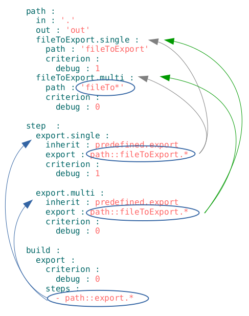

# Селектори

###  Селектор
**Селектор** - рядок-посилання на ресурс або декілька ресурсів в `will-файлі`. Селектори формулюються як назви ресурса в відповідних полях.  

 
 
Позначені на рисунку селектори - прості - мають пряме посилання на ресурс.  В полі `export` використовується селектор вигляду `Назва секції :: Назва ресурса` - йому віддається перевага, якщо йде посилання на ресурс секції `will-файла`. Наприклад, селектор `export.single` в секції `build` записується `step::export.single`.

###  Селектор з ґлобом
**Селектор з ґлобом** - селектор, який для вибору ресурсу використовує пошукові шаблони - ґлоби.
[Globbing](https://linuxhint.com/bash_globbing_tutorial/) - представляє собою аналог регулярних виразів  для пошуку файлів в bash-терміналі.  

  

На рисунку показаний ґлоб `*`, який означає будь-яку кількість симоволів, включаючи, відсутність символів. Таким чином, під селектор `step::export.*` в збірці `export` підходять кроки `export.single` i `export.multi`, подальший відбір проходить по критеріонам. Аналогічна ситуація при виборі шляхів кроками `export.single` i `export.multi`. Селектор `fileTo*` в ресурсі `fileToExport.multi` відрізняється від попередніх тим, що посилається на файли і директорії операційної системи.