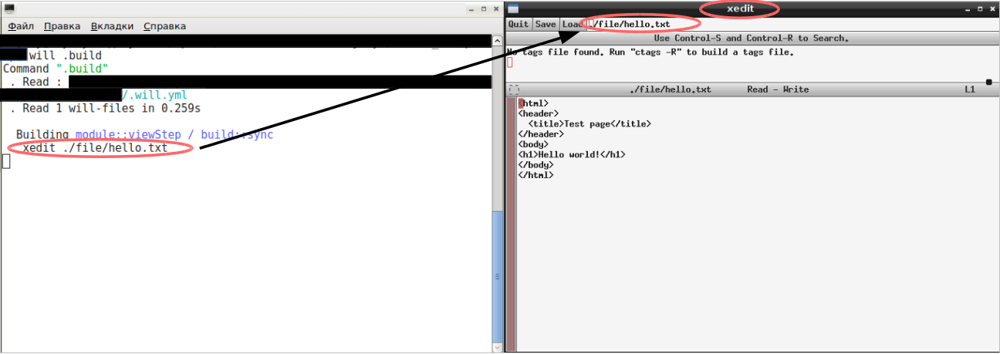

# Перегляд файлів модуля

Як користуватись вбудованим кроком `predefined.view` для перегляду файлів   

В процесі і після побудови модуля, зазвичай, потрібно перевірити правильність виконання операцій. Одним із способів є запуск файлів для їх виконання, редагування, перегляду. При побудові модуля запуск файла можна здійснити використавши вбудований крок `predefined.shell`, що потребує визначення програми, яка відкриє файл. До того ж, використання кроку `predefined.shell` в утиліті `willbe` є синхронним, тобто, утиліта, відкривши файл, зупинить виконання побудови модуля до моменту закриття файла. Для вирішення задачі в утиліті є вбудований крок `predefined.view`, який призначений для асинхронного запуску файлів.  

### Конфігурація 
Для дослідження вбудованого кроку `predefined.view`, створіть структуру файлів як приведено нижче та внесіть в файли код:  


<details>
  <summary><u>Структура модуля та код файлів <code>.will.yml</code>, <code>hello.html</code>,<code>hello.txt</code></u></summary>

```
viewStep
    ├── file
    │     ├── hello.html
    │     └── htllo.txt
    └── .will.yml

```

<p>Код <code>.will.yml</code></p>

```yaml
about :

  name : viewStep
  description : "To use predefined.view step"
  version : 0.0.1

path :
  in : '.'
  html : './file/hello.html'
  txt : './file/hello.txt'

step : 

  shell.open :
    shell : xedit {path::txt}

  view.html :
    inherit : predefined.view
    filePath : path::html
    delay : 10000
  
  view.txt :
    inherit : predefined.view
    filePath : path::txt
    delay : 1000  

build :
  
  sync :
    criterion :
      default : 1
    steps :
      - step::shell.open
      - step::view.html
      - step::view.txt

  async :
    steps :
      - step::view.html
      - step::view.txt
      - step::shell.open

```

<p>Код <code>hello.html</code> i <code>hello.txt</code></p>

```html
<html>
<header>
  <title>Test page</title>
</header>
<body>
  <h1>Hello, world!</h1>
</body>
</html>

```

</details>

Файли `hello.html` i `hello.txt` мають різні розширення для того, щоб утиліта викликала програми для перегляду веб-сторінок і текстовий редактор (якщо у вас в налаштуваннях операційної системи ці файли відкривають різні програми).   
В секції `build` `will-файла` поміщено дві збірки - `sync` з першим по порядку кроком `shell.open` i збірка `async` з першим кроком `view.html`, що, відповідно, покажуть синхронне виконання побудови модуля і асинхронне. Текстовий редактор `xedit` в кроці `shell.open` змініть на встановлений в вашій операційній системі.    
Кроки `view.html` i `view.txt` використовують вбудований крок перегляду файлів `predefined.view`. Для виклику кроку в полі `inherit` вказується `predefined.view`, шлях до файла - в полі `filePath`, затримка до запуску файла (в мс) - в полі `delay`.  

### Побудова модуля  
Запустіть побудову за замовчуванням:

<details>
  <summary><u>Вивід консолі та текстового редактора при введені <code>will .build</code></u></summary>
    


</details>

Після того, як відкрився файл `hello.txt` в редакторі `xedit`, виконання побудови перейшло в режим очікування. Продовження побудови можливе після завершення роботи текстового редактора тому, закрийте його і прослідкуйте за виконанням побудови модуля.  

<details>
  <summary><u>Вивід консолі після закриття файла, браузер, текстовий редактор</u></summary>


</details>

Переглянувши вивід команди видно, що побудова модуля завершилась раніше, ніж були відкриті файли. Також, файли відкриті згідно затримок, визначених в кроках, а не в порядку запису сценарію збірки.  
Запустіть побудову збірки `async`:  

<details>
  <summary><u>Вивід консолі при побудові збірки <code>async</code></u></summary>


</details>

Як і в попередньому виводі, першою було запущено команду в кроці `shell.open`. Це пов'язано з встановленням затримки в кроках `view.txt` i `view.html`. Крок `shell.open` також заблокував побудову і вона буде завершена при закритті програми `xedit`.

### Підсумок    
- Вбудований крок `predefined.view` дозволяє відкривати файли не блокуючи побудову модуля.
- Затримкою відкриття файлів можна сформувати послідовність перегляду файлів.

[Повернутись до змісту](../README.md#tutorials)