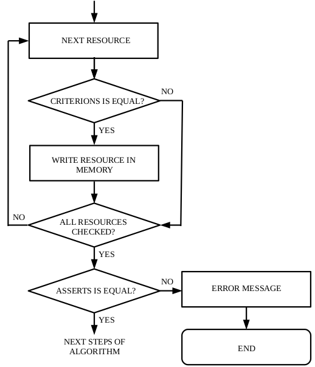
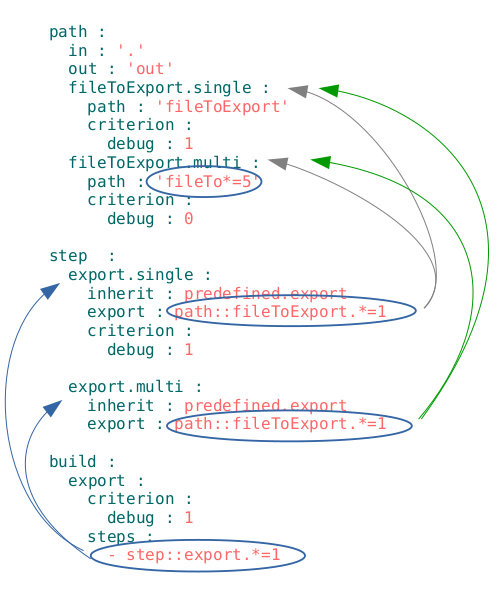

# Ґлоб з ассертом

Обмеження кількості ресурсів, що мають бути знайдені селектором з ґлобом

Ассерт - це спеціальна конструкція, що дозволяє перевіряти припущення про значення довільних даних в довільному місці програми.  

При побудові модуля дані зводяться до ресурсів `will-файла` і припускається, що селектор вибирає задану (запрограмовану) кількість ресурсів. Якщо використовуються прості селектори, то це припущення вірне, а в випадку використання ґлобів не виключена логічна помилка. Тому, використання ґлобів разом з ассертами є гарною практикою.   

Ґлоб з ассертом - обмеження вибірки селектора з ґлобом числовим значенням для локалізації місця помилки та попередження виконання небажаних дій.   

#### Приклад алгоритму перевірки на кількість входжень

Алгоритм виконує перевірку ресурсів на співпадіння мап критеріонів. При співпадінні утиліта записує інкрементує лічильник ресурсів. Після перевірки всіх ресурсів іде порівняння на кількість входжень - значення лічильника порівнюється з встановленим в ассерті.  

### Використання ассертів

Ассерт записуєтся після ґлобу та має вигляд `=n`, де `n` - позначає кількість входженнь. Наприклад, в більшості випадків, селектор має обирати один ресурс секції `will-файла` і тому використовується ассерт '=1'.  

#### Приклад `will-файла` з використанням ассертів  

  

На рисунку селектор `step::export.*` в збірці `export` може виконати кроки `export.single` i `export.multi`. Через помилку в `will-файлі` (відсутність критеріонів в кроці `export.multi` - див. [критеріон](Criterion.md)) побудова буде зломана, оскільки, за один крок в сценарії збірки виконується один крок в секції `step`. Без ассертів утиліта `willbe` видасть повідомлення про помилку, яку буде складно локалізувати, а при використанні ассертів в термінал виводиться повідомлення про місце і ресурси, в яких виникла помилка.  Також, розробник обмежив кількість входжень файлів, які починаються на `fileTo` п'ятьма файлами (поле `path: 'fileTo*=5'` в шляху `fileToExport.multi`). Якщо кількість входжень зміниться, то побудова буде відмінена.

  

На рисунку показано частину повідомлення про помилку в виборі ресурсів для `will-файла` на рисунку вище.  
   
