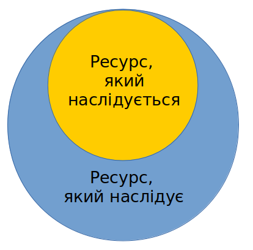

# Наслідування

Принцип опису модуля, згідно якого ресурс <code>will-файла</code> здатний використовувати (наслідувати) значення полів інших ресурсів того ж типу.

При наслідуванні ресурс-нащадок, можливо доповнювати новими значеннями полів, яких не було в предка або ці поля предка мали інше значення. Наслідування дозволяє повторно використовувати ресурси `will-файла`, що спрощує розробку та дизайн модулів.

На діаграмі зображено як відносяться ресурс, що наслідується і ресурс, який наслідує.

### Використання ресурсів того ж модуля

Для наслідування в межах одного `will-файла` потрібно:  
- вказати ресурс-предок який буде наслідуватись в полі `inherit` ресурса-нащадка. Наприклад: `inherit : reflector::some`
- за необхідністю, змінити або доповнити поля ресурса.  

### Використання ресурсів іншого модуля

Для наслідування з іншого `will-файла`:  
- підключити сторонній `will-файл` як підмодуль в секції `submodule`;  
- вказати в полі `inherit` селектор до ресурса, який буде наслідуватись. Наприклад: `inherit : submodule::NameOfSubmodule/section::NameOfSection/NameOfResource`, тобто, явно вказується підмодуль, секція і ресурс;  
- за необхідністю, вказати для ресурса-нащадка критеріони і доповнити поля ресурса.
