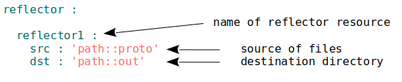
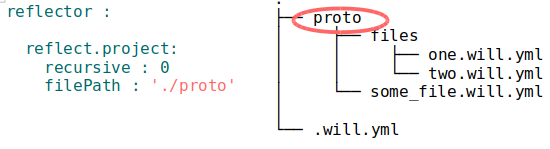
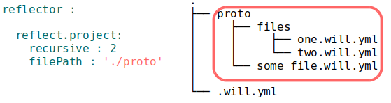

### Ресурс рефлектор

Ресурс секції <code>reflector</code>, спосіб опису множини файлів для виконання якоїсь операції над ними.

### Приклад

Kos : simplify illustration, please, add arrows with labels. Add long description after illustration.



Приклад секції `reflector` з ресурсом `reflect.project`.

### Поля ресурсу `reflector`

| Поле           | Опис                                                       |
|----------------|------------------------------------------------------------|
| description    | Пояснення для інших. розробників                                            |
| recursive      | Включати файли із піддиректорій чи ні. Можливі значення: `0`, `1`, `2`. Значення за замовчуванням `2`. |
| mandatory      | Викидати помилку якщо не знайдено жодного файла. Можливі значення: `0`, `1`. Значення за замовчуванням `1`. |
| filePath       | Мапа шляхів. |
| src            | Філтри файлів над якими потрібно здійснити операцію. |
| dst            | Філтри файлів, в які треба записати результат виконання операції, якщо такий є. |
| criterion      | [Умови](Criterions.md) використання ресурса                |
| inherit        | Наслідування значень полів іншого рефлектора                  |

Поля `src`, `dst` можуть мати під-поля, що описують [файлові фільтри](ReflectorFileFilter.md).   

### Мапа шляхів

Поле рефлектора та спосіб опису множини файлів, котрий дозволяє включити в неї безліч файлів і виключити із неї не потрібні файли за допомогою умов виключення та глобів.

Мапа шляхів може:
- задавати розміщення файлів над якими необхідно виконати, якусь операцію;
- задавати розміщення файлів в які потрібно записати результат операції;
- може вказувати безліч директорій;
- безліч умов виключення файлів із вибірки;
- виключення файлів із вибірки, що співпадають із глобом через `false` чи `0`;
- виключення файлів із вибірки, що не співпадають із глобом через `true` чи `1`.

Мапа шляхів може задаватися в полі `filePath` або в полі `src.filePath` чи `dst.filePath` рефлектора. При наслідуванні умови виключення успадковуються( ті котрі `0`, `1`, `false`, `true` ), а директорій ( ті шляхи, які мають в значенні `null` або якийсь шлях ) в яких вести пошук переписуються осатннім предком або безпосередньо нащадком.

Виключати файли із вибірки можливо не лише мапою шлхяів, але і [фільтрами файлів](<./ReflectorFileFilter.md#>).

### Приклад мапи шляхів із умовами виключення

```yaml
src:
  filePath:
    'some/dir1' : null
    'some/dir2' : null
    '**.debug**' : 0
    '**.js' : 1
```

- `'some/dir1' : null` - шлях пошуку.
- `'some/dir2' : null` - шлях пошуку.
- `'**.debug**' : 0` - негативна умова виключення.
- `'**.js' : 1` - позитивна умова виключення.

Читається так: переглянути всі файли в директоріях `some/dir1` та `some/dir1`, відкинути всі файли, що мають в шляху `.debug` або не зкінчуються розширенням `.js`.

### Поле рефлектора `mandatory`

Поле, яке керує видачею помилки про відсутність файлів за указаним шляхом. При значенні `mandatory : 1` утиліта видасть помилку і завершить побудову, якщо за указаним шляхом не буде знайдено жодного файлів, а при `mandatory : 0` помилки викинуто не буде і процедура побудови продовжеться. За замовчуваням має значення `1`.

### Поле рефлектора `recursive`

Рефлектор має поле `recursive` для того щоб обмежити глибину пошуку файлів. За замовчування глибина пошуку не обмежена і це поле має значення `2`.

Поле `recursive` приймає три можливі значення:

- `0` - Вибрати лише файл вказана в шляху.
- `1` - Вибрати файл вказаний в шляху і всі файли, які він містить якщо це директорія.
- `2` - Вибрати всі файли по вказаному шляху на всіх рівнях вкладеності, без обмежень.

### Приклади використання поля `recursive`



При значенні `recursive : 0` буде вибрано лише директорію `proto` указану в шляху `filePath`.  


При значенні `recursive : 1` буде вибрано вміст директорії `proto` та її вміст, тобто, файл `some_file.will.yml` i директорію `files`.



При значенні `recursive : 2` буде вибрано весь вміст директорії `proto` всіх рівнів вкладеності, включаючи файли в директорії `files` і наступних рівнів за наявності.

### Поля `basePath` i `prefixPath`  

Для вказання розміщення файлів в фільтрах `src` i `dst` використовуються поля `basePath`, `prefixPath` i `filePath`.  

`basePath` - базовий шлях до файлів відносно якого задаються всі інші шляхи даного рефлектора. Початкова точку відліку для шляхів.

`prefixPath` - шлях, який додається, як префіс до всіх шляхів рефлектора, наприклад до `basePath` i `filePath`.  

### Приклад формування шляху з полем `prefixPath`   

```yaml
src :
  prefixPath : 'out/out.debug'
  filePath :
    - File1.js
    - File2.js
```

Префікс `./out/out.debug/` буде додано до обох файлів описаних в `filePath` таким чином рефлектор вибере 2-ва файли `out/out.debug/File1.js` та `out/out.debug/File2.js`.

### Секція <code>reflector</code>  

Секція містить рефлектори - ресурси для виконання операцій над групами файлів.
Основними операціями є вибір файлів (директорій) та копіювання.
