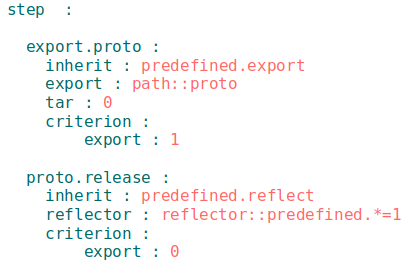

## Ресурс крок

Ресурс секції <code>step</code>, який представляє собою інструкцію для виконання утилітою при побудові модуля. Описують операції та бажаний результат. Збірки складаються із кроків.

#### kos : improve, please. will discuss how to

### Приклад



Приклад секції `step` з кроками `export.proto`, `proto.release`.

### Поля ресурсів секції `step`   

| Поле           | Опис                                                             |
|----------------|------------------------------------------------------------------|
| description    | описова інформація для інших розробників                         |
| criterion      | умова використання ресурса (див. [критеріон](Criterions.md))     |
| opts           | додаткові опції можуть передаватися через мапу `opts`            |
| inherit        | наслідування від інших кроків                                    |

### Таблиця вбудованих кроків    

| Вбудований крок      | Опис                                                 | Структура полів (unique)        |
|----------------------|------------------------------------------------------|--------------------------------|
| predefined.delete    | Для видалення файлів і директорій за вказаним шляхом | filePath                       |
| predefined.reflect   | Виконує виклик рефлектора                            | reflector, verbosity           |
| timelapse.begin      | (В стадії розробки)                                  | -                               |
| timelapse.end        | (В стадії розробки)                                  | -                               |
| predefined.js        | Виконання JavaScript-файлів                          | js; (js)                       |
| predefined.shell     | Використання командної оболонки операційної системи  | shell, currentPath, forEachDst, upToDate; (shell) |
| predefined.transpile | Об'єднання групи JavaScript-файлів в один            | reflector                       |
| predefined.view      | Відображення HTML або txt сторінки в браузері        | filePath, delay                 |
| submodules.download  | Завантаження підмодулів                              | -                               |
| submodules.upgrade   | Оновлення підмодулів                                 | -                               |
| submodules.clean     | Очищення підмодулів                                  | -                               |
| clean                | Видалення з директорії в якій знаходиться модуль 3-х типів файлів 1) завантажені підмодулі (папка `./.module`); 2) out директорія; 3) path::temp директорія, якщо вона прописана в will-файлі                                                        | -                               |
| predefined.export    | Для виконання експорту модуля                        | export, tar; (export)           |  

В третій колонці в дужках вказано `unique` - при наявності цієї опції достатньо вказати зазначене поле для виконання кроку.  

Для використання вбудованих кроків потрібно внести їх в ресурс секції `step`. Вбудовані кроки `submodules.download`, `submodules.upgrade`, `submodules.clean`, `clean` вносяться в секцію `build` (в полі `steps`).

### Приклади запису вбудованих кроків  
Всі вказані приклади записані без критеріонів. Критеріони додаються згідно правил використання.   

### Вбудований крок `predefined.delete`:

```yaml
step:                                   # Назва секції
  predefined:                           # Назва кроку
    inherit: predefined.delete          # Наслідування вбудованого кроку видалення файлів
    filePath: path::fileToDelete        # Файл чи директорія 'fileToDelete' в секції 'path'

```

### Вбудований крок `predefined.reflect`:

```yaml
step:                                         # Назва секції
  predefined:                                 # Назва кроку
    inherit: predefined.reflect               # Наслідування вбудованого кроку виклика рефлектора
    reflector: reflector::reflect.some.files  # Виклик рефлектора із секції 'reflector'  
    verbosity: 3                              # Деталізація логу виконання побудови модуля (значення                                             # від 0 до 8)

```

### Вбудований крок `predefined.js`:

```yaml
step:                                   # Назва секції
  predefined:                           # Назва кроку
    inherit: predefined.js              # Наслідування вбудованого кроку використання терміналу ОС
    js: path::jsFileToRun               # Шлях до JS-файла в секції 'path'

```

Вбудований крок може бути записана в скороченій формі:  

```yaml
step:                                   
  predefined:                           
    js: path::jsFileToRun               

```

### Вбудований крок `predefined.shell`:

```yaml
step:                                   # Назва секції
  predefined:                           # Назва кроку
    inherit: predefined.shell           # Наслідування вбудованого кроку використання терміналу ОС
    shell: [some_command]               # Команда для вводу в термінал ОС
    currentPath: path::dirToRun         # Вказується директорія в якій виконується файл
    forEachDst : some_reflector         # Рефлектор для команди (необов'язково)
    upToDate : 'preserve'               # Опція - виконувати команду при зміні файлів вибірки

```

Вбудований крок може бути записана в скороченій формі. При відсутності поля `currentPath` за замовчуванням встановлюється значення поточної директорії `will`-файла.  

```yaml
step:                                   
  predefined:                         
    shell: [some_command]
    currentPath: path::dirToRun         

```

### Вбудований крок `predefined.transpile`:

```yaml
step:                                           # Назва секції
  predefined:                                   # Назва кроку
    inherit: predefined.transpile               # Наслідування вбудованого кроку об'єднання JS-файлів
    reflector: reflector::reflect.js.files      # Рефлектор для відбору JS-файлів

```

В рефлекторі необхідно вказати шляхи для файлів, які будуть скомпоновані і файл, який згенерується. Для цього в рефлекторі вказуйте відповідні фільтри. Наприклад, для поля `filePath` рефлектора:  
```yaml
  filePath :                                    # Вказується для вибору JS-файлів
    path::filesFrom : '{path::filesTo}/file.js' # Зліва - директорія з якої беруться файли,
                                                # справа - директорія в який буде згенеровано файл і його назва.

```

### Вбудований крок `predefined.export`:

```yaml
step:                                   # Назва секції
  predefined:                           # Назва кроку
    inherit: predefined.export          # Наслідування вбудованого кроку експорту модуля
    export: path::fileToExport          # Шлях до файлів модуля, що експортуються
    tar: 0                              # Архівування експортованої конфігурації. '1' - ввімкнена,
                                        # '0' - вимкнена. За замовчуванням '1'

```

Вбудований крок може бути записана в скороченій формі.

```yaml
step:                                   
  predefined:                           
    export: path::fileToExport          

```

### Вбудований крок `predefined.view`:

```yaml
step:                                         # Назва секції
  predefined:                                 # Назва кроку
    inherit: predefined.view                  # Наслідування вбудованого кроку відображення HTML файла
    filePath: path::html_file                 # Шлях до HTML файла
    delay: 1000                               # Затримка запуску файла

```

### Вбудовані кроки, що вносяться в секцію `build`

Поміщені в один сценарій збірки, але використовуються окремо:  

```yaml
build:                                  # Назва секції
  predefined:                           # Назва кроку
    steps:                              # Кроки - сценарій збірки
    - submodules.download               # Вбудовані кроки, що поміщаються в секцію `build`
    - submodules.upgrade                
    - submodules.clean
    - clean                             

```

### Секція <code>step</code>

Секція містить кроки, які можуть бути застосовані збіркою для побудови модуля. Ресурси секції - кроки - поміщають в сценарії збірок секції <code>build</code> для виконання побудови.
