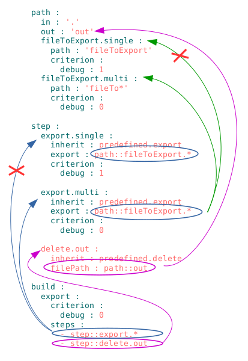

### Селектор

Рядок-посилання на ресурс або декілька ресурсів модуля.

#### Приклад секцій `will-файла` з селекторами  

kos : problem on the illustration

Позначені на рисунку селектори - прості - мають пряме посилання на ресурс.  В полі `export` використовується селектор вигляду `Назва секції :: Назва ресурса` - йому віддається перевага, якщо йде посилання на ресурс секції `will-файла`. Наприклад, селектор `export.single` в секції `build` можна записати `step::export.single`.

### Селектор з ґлобом

Селектор, який для вибору ресурсу використовує пошукові шаблони - ґлоби.  

[Globbing](https://linuxhint.com/bash_globbing_tutorial/) - представляє собою аналог регулярних виразів  для пошуку файлів в bash-терміналі.  

#### Приклад селекторів з ґлобами в `will-файлі`

  

На рисунку приведено ґлоб `*`, який означає будь-яку кількість симоволів, включаючи, відсутність символів. Таким чином, селектор `step::export.*` в збірці `export` задовільняють кроки `export.single` i `export.multi`, подальший відбір проходить по критеріонам. Аналогічна ситуація при виборі шляхів кроками `export.single` i `export.multi`. Селектори в секції `path` посилається на файли і директорії операційної системи.
