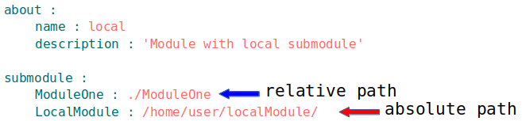

# Локальні і віддалені підмодулі

### Локальний підмодуль  

Підмодуль, який розташовується на машині користувача.  

Модуль, який розташовується на локальній машині можна підключити як підмодуль іншого модуля. Для підключення підмодуля в секції `submodule` вказується ресурс з шляхом до `вілфайла` іншого модуля. Для підключення локального підмодуля краще використовувати експортовані `some_name.out.will`-файли, оскільки вони містять інформацію про модуль і збірки по яким він побудований.  

### Приклад локального підмодуля



Модуль має 2-ва локальних підмодулями - `ModuleOne` i `LocalModule`. Перший локальний підмодуль поміщається в директорії `ModuleOne`, яка знаходиться в директорії модуля (відносний шлях), а другий - в директорії за шляхом `/home/user/localModule/` (абсолютний posix шлях).

### Віддалений підмодуль  

Модуль, який знаходиться на віддаленому сервері, для використання завантажується на локальну машину. Завантажуються віддалені підмодулі в директорію <code>.module</code> директорії поточного модуля.

Для підключення віддаленого підмодуля вказується ресурс з URI-шляхом в секції `submodule`.

```yaml
submodule :
    Tools : git+https:///github.com/Wandalen/wTools.git/out/wTools#master
    PathFundamentals : git+https:///github.com/Wandalen/wPathFundamentals.git/out/wPathFundamentals#master
    Color : npm:///wColor/out/wColor#0.3.102
```
Модуль підключає підмодулі `Tools` i `PathFundamentals`.

### Засоби управліяння віддаленими підмодулями

- команда `will .submodules.list` перераховує підключені підмодулі та інформацію про них;
- команда `will .submodules.download` завантажує файли віддалених підмодулів
- вбудований крок [`submodules.download`](ResourceStep.md#submodulesdownload) завантажує файли віддалених підмодулів
- команда `will .submodules.update` завантажує найновіші версії файлів віддалених підмодулів ( без пропатчування `вілфайла` )
[`submodules.download`](ResourceStep.md#submodulesdownload) завантажує файли віддалених підмодулів
- вбудований крок [`submodules.update`](ResourceStep.md#submodulesupdate) завантажує файли віддалених підмодулів
- команда `will .submodules.fixate` фіксує версії підмодуля, пропатчучи `вілфайл` поточного модуля шляхами до найновіших версій віддалених підмодулів, якщо не була вказана конкретна версія
- команда `will .submodules.upgrade` оновляє версії підмодулів, пропатчучи `вілфайл` поточного модуля шляхами до найновіших версій віддалених підмодулів
( якщо новіші версії наявні )
- команда `will .submodules.clean` видаляє файли віддалених підмодулів ( директорія `.module` )
- вбудований крок [`submodules.clean`](ResourceStep.md#submodulesclean) видаляє файли віддалених підмодулів ( директорія `.module` )
