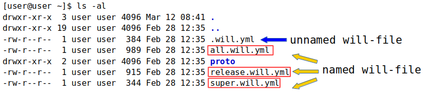

# Іменовані і розділені `will-файли`

### Іменований <code>will-файл</code>

Вид <code>will-файла</code>, що має не стандартне ім'я файлу. Дозволяє мати більше одного модуля із різними іменами файлів в одній директорії.

`Will-файл`, назва якого має вигляд `.will.[розширення]` вважається неіменованим. Через колізію імен в директорії одночасно може знаходитись лише один неіменований `will-файл`, проте кількість іменованих `will-файлів` не обмежена.

  

На рисунку показаний вивід команди `ls -al` в директорії модуля з іменованими `will-файлами`.

#### Команда `.with` для іменованимих `will-файлів`

Для роботи з іменованими `will-файлами` використовується команда [`.with`](../tutorial/WillFileNamed.md).

#### Приклад використання команди `.with` із іменованими `will-файлами`

```
will .with final.release.will.yml .build release
```

Команда побудови збірки `release` для іменованого `will-файла` `final.release.will.yml`.

#### Команда `.each` для іменованих `will-файлів`

Для роботи з групою `will-файлів` використовується команда [`.each`](../tutorial/CommandEach.md).

### Спліт <code>will-файл</code>

Розділення <code>will-файла</code> на два файла - для імпорту та експорту модуля. Дозволяє розробнику розділити дані для побудови модуля і дані для використання цього модуля іншими модулями.

Ресурси описані в одному з розділених `will-файлів`, доступні в другому, що позбавляє необхіності дублювати дані. Спліт можливий як для неіменованого `will-файла`, так і для іменованого. При розділенні неіменованих `will-файлів`, файл імпорту називається `.im.will.yml`, а файл експорту - `.ex.will.yml`.  

Структура розділених неіменованих `will-файлів`:   

```
.
├── .im.will.yml    # спліт-файл імпорту
├── .ex.will.yml    # спліт-файл експорту

```

Спліт іменованих `will-файлів` відрізняється від неіменованих ім'ям перед відповідним розширенням.
```
.
├── first.im.will.yml    # спліт-файл імпорту
├── first.ex.will.yml    # спліт-файл експорту

```
Наприклад, `will-файл` з назвою `first` буде розділений на `first.im.will.yml` для файлу імпорту і `first.ex.will.yml` для файла експорту:  

#### Приклад з двома модулями в одній директорії


Вивід команди `ls -al` в директорії модуля зі сплітом іменованого та сплітом неіменованого `will-файлів`.
