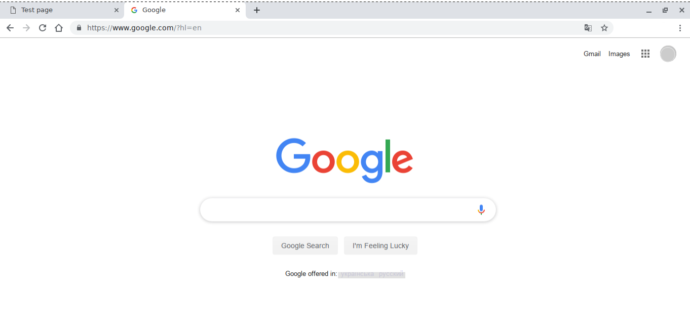

# Як користуватись вбудованим кроком `predefined.view`

Використання вбудованого кроку `predefined.view` для перегляду файлів   

В процесі і після побудови модуля, зазвичай, потрібно перевірити правильність виконання операцій. Одним із способів є запуск файлів для їх виконання, редагування, перегляду. Для вирішення задачі в утиліті є вбудований крок `predefined.view`, який призначений для запуску файлів.  

### Конфігурація 
Для дослідження вбудованого кроку `predefined.view`, створіть структуру файлів як приведено нижче та внесіть в файли код:  

<details>
  <summary><u>Структура модуля</u></summary>

```
viewStep
    ├── file
    │     ├── hello.html
    │     └── htllo.txt
    └── .will.yml

```

</details>
<details>
  <summary><u>Код файла <code>.will.yml</code></u></summary>

```yaml
about :

  name : viewStep
  description : "To use predefined.view step"
  version : 0.0.1

path :
  in : '.'
  html : './file/hello.html'
  txt : './file/hello.txt'
  url : 'https://www.google.com/'

step : 

  view.url :
    inherit : predefined.view
    filePath : 'https://github.com/'
    delay : 12000

  view.html :
    inherit : predefined.view
    filePath : path::html
    delay : 8000
  
  view.txt :
    inherit : predefined.view
    filePath : path::txt
    delay : 1000  

build :
  
  open.view :
    criterion :
      default : 1
    steps :
      - view.url
      - step::view.html
      - step::view.txt

```

</details>
<details>
  <summary><u>Код <code>hello.html</code> i <code>hello.txt</code></u></summary>

```html
<html>
<header>
  <title>Test page</title>
</header>
<body>
  <h1>Hello, world!</h1>
</body>
</html>

```

</details>

Файли `hello.html` i `hello.txt` мають різні розширення для того, щоб утиліта викликала програми для перегляду веб-сторінок і текстовий редактор (якщо в налаштуваннях операційної системи ці файли відкривають різні програми).  
Крок `view.url` показує, що крім файлів утиліта може відкрити URL-посилання.  
Кроки `view.url`, `view.html` i `view.txt` використовують вбудований крок перегляду `predefined.view`. Для виклику кроку в полі `inherit` вказується `predefined.view`, шлях до файла чи посилання - в полі `filePath`, затримка до запуску (в мс) - в полі `delay`.  

### Побудова модуля  
Запустіть побудову:

<details>
  <summary><u>Вивід команди <code>will .build</code></u></summary>
    
```
[user@user ~]$ will .build
...
  Building module::viewStep / build::open.view
  Built module::viewStep / build::open.view in 0.280s

View path::txt
View path::html
View path::url

```

</details>

Згідно виводу було відкрито два фали і посилання в послідовності затримок в кроках. Вивід в програмах приведено нижче:  

<details>
  <summary><u>Вивід текстового редактора</u></summary>
    


</details>
<details>
  <summary><u>Вивід браузера. HTML-файл</u></summary>
    


</details>
<details>
  <summary><u>Вивід браузера. URL-посилання</u></summary>
    


</details>

### Підсумок    
- Вбудований крок `predefined.view` дозволяє відкривати файли і посилання.
- Затримкою відкриття, визначеною в кроці, можна сформувати послідовність перегляду файлів.

[Повернутись до змісту](../README.md#tutorials)